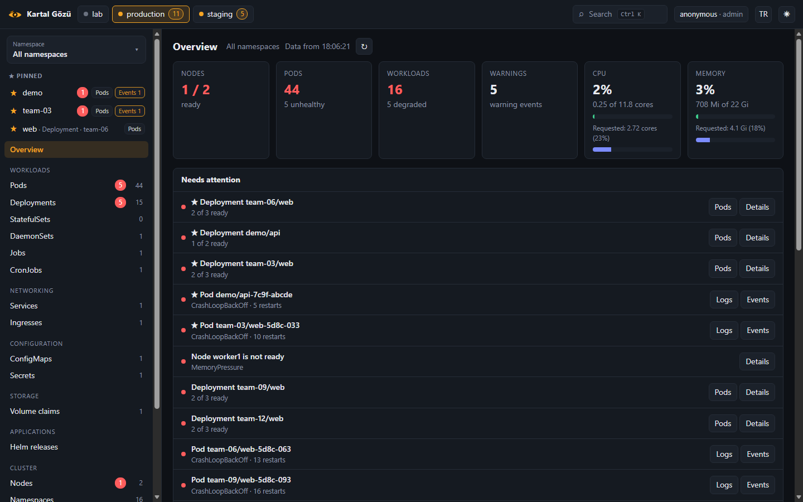
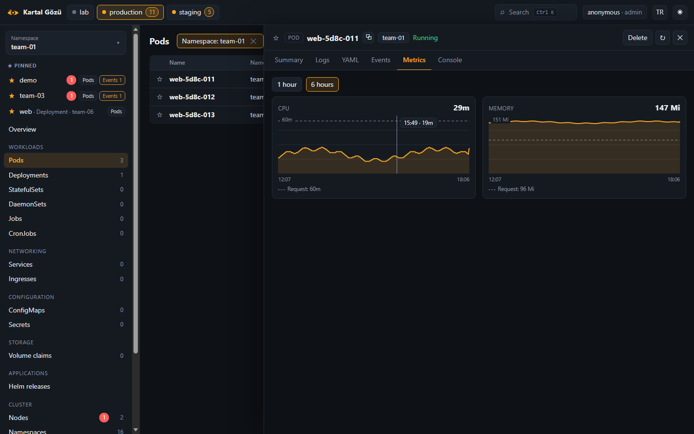

# Kartal Gözü

**See and operate all of your Kubernetes clusters from one place.**

Kartal Gözü ("eagle eye" in Turkish) is a small self-hosted server with a web
UI, plus an agent that runs in each cluster. It is built for locked-down
networks: agents only make short outbound HTTPS requests (no WebSocket, no
tunnel), and the server works under any URL path without configuration.



## Highlights

- **Every cluster in one place.** Nodes, workloads, pods, services, ingresses,
  volume claims, jobs, cron jobs, Helm releases, warning events and any custom
  resource.
- **Everything about an object in one panel.** Click any name: a side panel
  shows its summary (status, conditions, containers with images, ports,
  requests and limits, labels), its YAML, its own events, its pods, and for a
  Deployment its rollout history.
- **Logs that answer "why did it crash?".** When a container has restarted,
  the panel says so and shows the previous container's logs with one click.
  Search highlights every match and steps through them; you can keep only the
  matching lines, merge all containers in time order, follow, copy and
  download.
- **Change things safely.** Restart, scale, roll back to an earlier revision,
  delete a pod, cordon a node, run a CronJob now or suspend it. Edit any object
  as YAML: the API server's dry run shows the exact change as a diff before
  you can save, and a newer version of the object is never overwritten.
- **A pod console that goes through the proxy.** Run commands in a container
  over plain HTTP requests; the working directory is kept between commands.
- **Capacity at a glance.** Usage next to what pods have requested, for the
  cluster and for every node, and CPU and memory charts of the last 1 or 6
  hours for the cluster, each node and each pod, with requests and limits
  drawn in.
- **Alerts.** Crash loops, failing image pulls, OOM kills, nodes that are not
  ready, degraded workloads, failed jobs, unbound volume claims and silent
  agents are collected on one page and sent to Microsoft Teams, e-mail or any
  webhook, with a message when they are resolved. E-mail is set up right on
  that page, and tried before it is saved.
- **Warnings before an outage.** Volumes that fill up, TLS certificates that
  are about to expire (in the cluster's Secrets and on any address), and URL
  checks that the server runs itself, with a 24-hour history for each.
- **The metrics your applications expose.** Open a pod to read what it
  exposes at `/metrics` (the Prometheus text format), searchable. Watch any of
  it, for one pod or every pod of a workload: requests per second from a
  counter, a queue's length, memory. The server reads it every 30 seconds,
  charts the last day, and raises an alert past a limit you set. Not sure
  what exposes metrics? One button asks a pod of every workload. No
  Prometheus needed.
- **What changed, and what runs where.** A timeline of what changed in each
  cluster (new images, scaling, restarts, nodes going away), with who did it
  when it was done through Kartal Gözü. The versions of every app side by
  side across clusters, with the differences marked. And, for any object,
  what was changed since the last `kubectl apply`.
- **Users, roles and an audit log.** Viewers look, operators act, admins also
  edit YAML and use the console, everywhere or only in the clusters and
  namespaces you choose. People can sign in with Active Directory or another
  LDAP directory, whose groups give them their roles. Every change is recorded
  with who made it.
- **Fast to get around.** A namespace picker scopes every view. Every column
  sorts. Press <kbd>Ctrl</kbd>/<kbd>⌘</kbd>+<kbd>K</kbd> to jump anywhere. Star
  a namespace or any row to pin it to the top.
- **Any URL path, any namespace.** Serve it at the root of a host or below
  `/devops/kartal` or any other path, whether or not the proxy strips the
  prefix. No manifest hard-codes a namespace.
- **No long-lived connections.** Agents push snapshots and long-poll for
  commands for at most 25 seconds; the browser uses ordinary requests too.
  Load balancers that cut WebSockets or close connections after 30 seconds are
  not a problem.
- **No dependencies.** The server and agent use only the Go standard library,
  with a small Kubernetes client of their own. The web UI is plain HTML, CSS
  and JavaScript embedded in the server binary. There is no build step and no
  CDN, and it works air-gapped.
- **Light on the network.** Every list carries an ETag computed from its
  content. A list that did not change answers the UI's 10-second refresh with
  an empty `304`, and the page is not redrawn. Larger responses are
  gzip-compressed.
- **Safe defaults.** Everything is read-only until you allow more, one kind of
  action at a time. Secret *values* never leave the cluster.

## Try it

```sh
go run ./cmd/kartal-demo
```

Then open http://127.0.0.1:8080/. The demo runs the real server and real
agents against simulated clusters, with every action allowed. One cluster has
no metrics-server and one never connects, so you can see how both look. The
charts start with six hours of invented history, and e-mail settings and URL
checks made in the UI last until the demo stops. There is something to find
on every page: a volume at 91%, a certificate that expires in twelve days, an
address that does not answer, release candidates in staging and, every two
minutes, a new build of one app in production. Options:

- `-ldap` signs people in against a small built-in directory: `ayse` is an
  admin, `mehmet` an operator in production's `team-0*` namespaces and all of
  staging, and `zeynep` a viewer of production. The password is `demo`.
- `-admin-token <token>` shows the sign-in page.
- `-namespaces 500` makes the main cluster big (1,500 pods) so you can check
  the speed.
- `-listen 127.0.0.1:9090` serves on another address.

## The web UI

- **Top bar:** each cluster with its status (online, offline or never
  connected) and a count of its problems. It also holds search
  (<kbd>Ctrl</kbd>/<kbd>⌘</kbd>+<kbd>K</kbd>), who you are signed in as, the
  language switch (English and Turkish) and the light/dark theme switch.
- **Sidebar**, from top to bottom:
  - **Namespace picker:** sets the scope of every view. Its searchable list
    puts pinned namespaces first. Each namespace has **Pods** and **Events**
    shortcuts, a red badge counting its unhealthy pods, and a count of its
    warning events.
  - **Pinned:** your starred namespaces (with the same shortcuts) and objects.
  - **Navigation by kind:** each entry shows a count for the cluster or the
    selected namespace, with a badge when something needs attention.
    - Overview
    - Workloads: Pods, Deployments, StatefulSets, DaemonSets, Jobs, CronJobs
    - Networking: Services, Ingresses
    - Configuration: ConfigMaps, Secrets, Certificates
    - Storage: volume claims, with how full each one is
    - Applications: Helm releases, Versions
    - Cluster: Nodes, Namespaces, Events
    - Operations: Alerts, URL checks, Changes, Audit log
    - All resources: a browser for every API type, including CRDs
- **Overview:** capacity, usage and requests, what needs attention, the
  cluster's usage over the last hour and recent warnings.
- **Changes:** what changed in the cluster (or the selected namespace), newest
  first: workloads created or deleted, new images, scaling, pod template
  changes such as restarts, schedule changes and suspensions of CronJobs, and
  nodes that were added, removed, cordoned or went not ready. A change made
  through Kartal Gözü says who made it (operators see that). The server keeps
  the last 5,000 changes in memory, from what the agents report; the first
  report after a start is only the baseline.
- **Versions:** every app's images in every cluster, side by side. Rows whose
  versions differ are marked, and "Only differences" keeps those and the apps
  missing from a cluster. A cell opens the app in that cluster.
- **Lists:** click a column header to sort (again to reverse, a third time for
  the natural order); the choice is remembered. "Problems only" keeps what
  needs attention. Starred objects come first, then everything in a starred
  namespace.
- **Detail panel:** opens beside the list, and can be widened by dragging its
  edge. Its tabs depend on the kind:

  | Tab | For |
  |---|---|
  | Summary | every kind; the built-in kinds get their own summary. An object applied with `kubectl apply` also shows what changed since: the fields the last apply set that differ now, which the next apply would set back |
  | Logs | pods, with init containers, previous containers and all containers merged |
  | Pods | Deployments, StatefulSets, DaemonSets, Jobs and nodes |
  | Jobs | CronJobs |
  | YAML | every kind: copy, download, and edit with a diff preview |
  | Events | every kind: the events about that object only |
  | Changes | Deployments, StatefulSets, DaemonSets, CronJobs and nodes: that object's timeline |
  | History | Deployments: revisions with images and change cause, and rollback |
  | Metrics | pods and nodes, 1 or 6 hours |
  | App metrics | pods, and Deployments, StatefulSets and DaemonSets through one of their running pods: the metrics they expose at a port and path (from the `prometheus.io/port` and `prometheus.io/path` annotations, or chosen), and Watch for any of them |
  | Console | pods, for admins |

  The panel follows the object while it is open. Buttons for actions you may
  not take are hidden; those the cluster's agent does not allow are shown
  disabled, with the setting that would allow them.

  
- **Keyboard:** <kbd>Ctrl</kbd>/<kbd>⌘</kbd>+<kbd>K</kbd> opens the palette,
  <kbd>/</kbd> jumps to the filter and <kbd>Esc</kbd> closes things. In the
  log search, <kbd>Enter</kbd> and <kbd>Shift</kbd>+<kbd>Enter</kbd> step
  through the matches.
- **Links:** every view and every open panel has its own URL, such as
  `#/c/production/pods?ns=payments&p=1` or
  `#/c/production/pods?o=core/v1/pods/payments/api-0&t=logs`, so you can
  bookmark or share it.

## How it works

```
   Cluster A                          Cluster B
 ┌────────────────┐                 ┌────────────────┐
 │  kartal-agent  │                 │  kartal-agent  │
 └──┬─────────▲───┘                 └──┬─────────▲───┘
    │snapshot │ commands               │         │
    │ (15 s)  │ (long-poll ≤ 25 s)     │         │
    ▼         │                        ▼         │
 ┌──────────────────────────────────────────────────┐
 │  kartal-server    https://example.org/<any/path>/ │
 │   …/              web UI                          │
 │   …/api/v1/*      management API (user tokens)    │
 │   …/agent/v1/*    agent endpoints (agent token)   │
 └──────────────────────────────────────────────────┘
```

- Every interval, the agent gzips a snapshot of its cluster and sends it. The
  server keeps each node's and pod's usage for six hours, one point a minute,
  and checks every snapshot for problems to alert on.
- When the UI needs something the snapshot does not have (logs, an object's
  YAML, events, history, a command in a container) or changes something, the
  server queues a command and wakes the agent's waiting long-poll at once. The
  agent runs the command and posts the result back.
- The server keeps state in memory. Agents resend a full snapshot every
  interval, so a restarted server has everything back within seconds; the
  charts' history, the change timeline, the URL checks' results, sign-in
  sessions and the audit log start over (the audit log is also written to the
  server's log). Settings made in the UI are kept, in a Secret or a file. For
  the same reason the server runs as a **single replica**.

## Installation

### 1. Image

```sh
make image IMAGE=registry.example.org/library/kartal-gozu:0.1.0
docker push registry.example.org/library/kartal-gozu:0.1.0
```

To use a private mirror, point the base images at it with
`--build-arg GO_IMAGE=...` and `--build-arg RUNTIME_IMAGE=...`. One image holds
both programs. It starts `kartal-server` by default, and the agent deployment
runs `kartal-agent`.

### 2. Server

Create one agent token per cluster, and a token for every user (or just one
admin token):

```sh
openssl rand -hex 24
```

```sh
NS=kartal-gozu   # any namespace you like
kubectl create namespace $NS
kubectl -n $NS create secret generic kartal-server \
  --from-literal=agent-tokens='staging=<token-1>,production=<token-2>' \
  --from-literal=admin-token='<admin-token>'
```

For named users, add a `users` key with one `name:grant:token` per line and
uncomment `KARTAL_USERS_FILE` in `deploy/server/deployment.yaml`; see
[Users and roles](#users-and-roles). To let people sign in with Active
Directory or LDAP, uncomment the `KARTAL_LDAP_*` variables there and put the
service account's password in the Secret as `ldap-password`; see
[Active Directory and LDAP](#active-directory-and-ldap). The manifests also create an empty
Secret, `kartal-server-settings`, where the server keeps the settings made in
the UI, and a Role that lets the server read and change that one Secret and
nothing else. Set `namespace` and `images` in
`deploy/server/kustomization.yaml`, then:

```sh
kubectl apply -k deploy/server
```

To publish it, see the Traefik example in
`deploy/examples/traefik-ingressroute.yaml`. Open its URL (with the sub-path,
if you use one) and sign in with your token.

### 3. Agent (in every cluster)

```sh
NS=kartal-gozu
kubectl create namespace $NS
kubectl -n $NS create secret generic kartal-agent --from-literal=token='<this cluster’s token>'
```

In `deploy/agent/deployment.yaml`, set `KARTAL_SERVER_URL`, including the
sub-path if there is one. You can limit the watched namespaces with
`KARTAL_NAMESPACES`. The agent reads only, until you allow more: for each
kind of action, set its variable to `"true"` and enable its RBAC file in
`kustomization.yaml`.

| File | Variable | Allows |
|---|---|---|
| `rbac.yaml` | — | Reading everything the UI shows, except Secrets (always included) |
| `rbac-browse.yaml` | `KARTAL_INCLUDE_SECRETS` for Secret names | Browsing every resource type, CRDs included; Helm releases, which Helm keeps in Secrets |
| `rbac-write.yaml` | `KARTAL_ALLOW_WRITE` | Restart, scale, rollback, deleting pods, cordoning nodes, running and suspending CronJobs |
| `rbac-exec.yaml` | `KARTAL_ALLOW_EXEC` | The pod console |
| `rbac-edit.yaml` | `KARTAL_ALLOW_EDIT` | Saving objects edited as YAML (common kinds; widen it in the file) |
| `rbac-volumes.yaml` | `KARTAL_VOLUME_STATS` | How full volume claims and the nodes' disks are, and how much disk each pod uses (ephemeral storage: writable layers, logs, `emptyDir`), asked from each node's kubelet once a minute |
| `rbac-certificates.yaml` | `KARTAL_TLS_SECRETS` | When the certificates of `kubernetes.io/tls` Secrets expire, read every five minutes |
| `rbac-pod-metrics.yaml` | `KARTAL_POD_METRICS` | The metrics that pods expose, read through the API server: a pod's page on request, and the watched metrics every 30 seconds |

Three of these grant more than their feature needs, because Kubernetes
cannot grant less: `rbac-volumes.yaml` gives `get` on `nodes/proxy`, which
reaches every read-only kubelet endpoint; `rbac-pod-metrics.yaml` gives `get`
on `pods/proxy`, which reaches every pod's HTTP endpoints; and
`rbac-certificates.yaml` lets the agent list all Secrets. The agent itself
reads only disk and volume statistics; only pages in the Prometheus text format, whose
metrics are all it passes on (never another page, nor an error page a pod
answers with); and only the `tls.crt` of TLS Secrets, never their keys.

```sh
kubectl apply -k deploy/agent
```

Within a few seconds the cluster shows up as online.

## Users and roles

Every request to the UI and the management API carries a token, and each
token belongs to a user with one of three roles:

| Role | May |
|---|---|
| `viewer` | See everything: lists, details, YAML, logs, events, charts, the metrics pods expose and the watched ones, alerts, changes, versions, URL checks |
| `operator` | Also restart, scale, roll back, delete pods, cordon nodes, run and suspend CronJobs, choose which metrics are watched, read the audit log, and see who made a change |
| `admin` | Also edit YAML, use the pod console, set up e-mail and URL checks, and send test notifications |

### Where a role applies

A role applies everywhere, or only where you say. A *grant* is written as
`role` (everywhere) or `role@scope+scope…`, where a scope is `cluster` (all
of it) or `cluster/namespace`. Either part may be `*` (any) or end in `*` (any
name that starts so):

| Grant | Means |
|---|---|
| `viewer` | viewer in every cluster and namespace |
| `operator@production/payments` | operator in one namespace |
| `operator@production/team-*+staging` | operator in production's `team-…` namespaces and in all of staging |
| `viewer@*/monitoring` | viewer of the `monitoring` namespace in every cluster |

Someone with roles only in some namespaces sees only those namespaces, their
objects and their alerts; the clusters list counts only what they may see.
Nodes, the cluster's usage, cordoning and other cluster-wide things need a
role over a whole cluster (`cluster` or `cluster/*`). The audit log shows
each operator the entries of the places where they are operators. The
server's own settings (e-mail, URL checks, test notifications) need an admin
role everywhere.

### Tokens

Users are listed in `KARTAL_USERS` (or the file in `KARTAL_USERS_FILE`) as
`name:grant:token` entries, separated by commas or newlines:

```
# name:grant:token
ayse:admin:3f0c…
oncall:operator:9a1d…
payments:operator@production/payments+staging/payments:77b2…
```

`KARTAL_ADMIN_TOKEN` adds one more user, named `admin`. Tokens are at least
16 characters.

### Active Directory and LDAP

With `KARTAL_LDAP_URL`, people sign in with their own user name and password,
and the groups they belong to give them their grants. A rule per line, in
`KARTAL_LDAP_GROUPS` (or the file in `KARTAL_LDAP_GROUPS_FILE`), reads
`group => grant`; the group is its CN or, when two groups share a CN, its
whole DN. Someone in several of the groups gets all of their grants; someone
in none cannot sign in.

```
Kartal-Admins => admin
Platform-Oncall => operator
Team-Payments => operator@production/payments-*+staging
CN=Developers,OU=Groups,DC=example,DC=org => viewer
```

The server looks a person up under `KARTAL_LDAP_USER_BASE` by
`sAMAccountName` (or `KARTAL_LDAP_USER_ATTR`, such as `uid`) and checks the
password by binding as them. To look people up it binds either as a service
account (`KARTAL_LDAP_BIND_DN` and `KARTAL_LDAP_BIND_PASSWORD` / `_FILE`) or,
in Active Directory, as the person themselves (`KARTAL_LDAP_UPN_DOMAIN`, such
as `example.org`, which makes `user@example.org`). Use `ldaps://`, or
`ldap://` with `KARTAL_LDAP_STARTTLS=true`; a private CA goes in
`KARTAL_LDAP_CA_FILE`. Groups come from `memberOf`, which lists the groups a
person is directly in.

People may write their name as `ayse`, `EXAMPLE\ayse` or, in Active
Directory, `ayse@example.org`; the audit log names them as the directory
does. Someone whose password has expired or must be changed, or whose
account is disabled or has expired, is told so (Active Directory says that
only after the right password); every other refusal reads "wrong user name
or password".

A sign-in gives a session that lasts `KARTAL_SESSION_TTL` (12 hours by
default), kept in the server's memory; signing out ends it at once. Tokens
from `KARTAL_USERS` keep working next to directory sign-in, for scripts. Five
failed attempts for a name within 15 minutes, or 30 within a minute in all,
make the server turn further attempts away for a while; every attempt is in
the audit log. A restart of the server ends every session.

What a role allows is still limited by what each cluster's agent allows: a
button the agent would refuse is shown disabled.

Every change a user's role allows goes to the audit log with the user, the
object and whether it worked. The UI shows the last 1,000 entries to
operators and admins; the server's log keeps all of them.

## Notifications

The server watches every snapshot. A problem that lasts `KARTAL_ALERT_AFTER`
(two minutes by default) is sent to every configured channel. Problems that
start together, or end together, go out as one message per cluster, and
resolved problems are sent too. Problems that came due while no channel was
on are sent as soon as one is.

| Problem | When |
|---|---|
| Agent offline | the agent has been silent longer than `KARTAL_STALE_AFTER` |
| Node not ready | a node is not ready |
| Node under pressure | a ready node reports `DiskPressure`, `MemoryPressure` or `PIDPressure`, and starts evicting pods |
| Pod failing | `CrashLoopBackOff`, `ImagePullBackOff`, `ErrImagePull`, `OOMKilled`, `Evicted` and similar, in init containers too; a Job's finished pods are left to the Job, and a failed pod that its Deployment, StatefulSet or DaemonSet already replaced is only counted as left behind |
| Workload degraded | fewer replicas are ready than wanted |
| Job failed | a Job gave up (its `Failed` condition); one still retrying is not a problem yet |
| Volume claim unbound | a claim is not bound |
| Volume filling up | a volume is 85% full (a warning) or 95% (critical), by space or by inodes; needs `KARTAL_VOLUME_STATS` on the agent |
| Node disk filling up | a node's root disk, or its images' disk when they have one of their own, is 80% full (a warning) or 90% (critical), by space or by inodes: before the kubelet starts evicting pods (85% for images, 90% for the root disk by default); needs `KARTAL_VOLUME_STATS` on the agent |
| Certificate expiring | a TLS Secret's certificate, or that of an address a URL check asks, expires within 14 days (a warning) or 3 days (critical), or has expired |
| Address not answering | a URL check fails: no answer, an error status, the wrong status or text, or a certificate that cannot be trusted |
| Metric past its limit | a watched metric's latest value is above or below the limit set for it |

The levels can be changed with `KARTAL_ALERT_VOLUME_WARNING` and
`KARTAL_ALERT_VOLUME_CRITICAL` (percent), `KARTAL_ALERT_NODE_DISK_WARNING`
and `KARTAL_ALERT_NODE_DISK_CRITICAL` (percent), and
`KARTAL_ALERT_CERT_WARNING_DAYS` and `KARTAL_ALERT_CERT_CRITICAL_DAYS`. The
lists in the UI mark volumes, nodes and certificates at the same levels.

Channels, any number of them together:

- **Microsoft Teams:** `KARTAL_ALERT_TEAMS_URL`, the URL of a Teams workflow
  ("Post to a channel when a webhook request is received"). Messages are
  Adaptive Cards.
- **E-mail:** set up on the Alerts page, by an admin (see below), or with
  `KARTAL_SMTP_ADDR` (`host:port`), `KARTAL_SMTP_FROM`, `KARTAL_SMTP_TO`
  (comma-separated), and optionally `KARTAL_SMTP_USERNAME` and
  `KARTAL_SMTP_PASSWORD` / `_FILE`. Port 465 uses TLS from the start; on
  other ports STARTTLS is used when the server offers it. A password is sent
  only over TLS, or to a relay on localhost.
- **Webhook:** `KARTAL_ALERT_WEBHOOK_URL` receives a JSON document.

### E-mail settings in the UI

On the Alerts page, **E-mail settings** (admins only) asks for the SMTP
server, the sender, the recipients and, if the server needs them, a user name
and password. **Send a test e-mail** tries the settings in the form before
anything is saved; **Save** keeps them and the channel starts at once, with no
restart.

- The settings are kept in the Secret named by `KARTAL_SETTINGS_SECRET`, in
  the server's own namespace (the manifests create `kartal-server-settings`),
  or in the file named by `KARTAL_SETTINGS_FILE` when the server runs outside
  Kubernetes. With neither, they last until the server restarts, and the form
  says so.
- The password is never sent back to the browser. Leave the field empty to
  keep the saved one.
- When the `KARTAL_SMTP_*` variables are set, they win: the form shows them
  and cannot change them.
- Every save and every test goes to the audit log.

Set `KARTAL_PUBLIC_URL` to the UI's address so messages link to it. Outbound
requests honour `HTTPS_PROXY`. The Alerts page shows active and recent
problems, the channels and the last deliveries; admins can send a test.

## URL checks

The server can watch addresses itself: the sites your clusters serve, and
anything else that people depend on. Admins add them on the **URL checks**
page, where **Try now** asks the address once before the check is saved.
Each check has:

- the address (`http://` or `https://`) and a name;
- how often to ask it, from every 30 seconds to every hour, and how long to
  wait for an answer;
- what counts as up: by default any status below 400, after up to five
  redirects; optionally an exact status, and a text that the answer must
  contain;
- whether to skip verifying the certificate, for a private CA (its expiry is
  watched all the same).

The page shows each check's state and how long it has been in it, a bar for
each of the last 24 hours, the share of good answers, the response time and
when the certificate expires. A failing check raises *Address not answering*
and a certificate close to its end *Certificate expiring*; these alerts
belong to no cluster and go to the same channels. Every change to the checks
is in the audit log.

The checks are kept with the other settings (`KARTAL_SETTINGS_SECRET` or
`KARTAL_SETTINGS_FILE`); their results, 24 hours of them, in memory. Requests
come from the server, so the addresses must be reachable from where it runs;
they honour `HTTPS_PROXY` and `NO_PROXY`. At most 200 checks, and 20 requests
at a time.

## Configuration

### Server

| Variable | Default | Meaning |
|---|---|---|
| `KARTAL_LISTEN` | `:8080` | Address to listen on |
| `KARTAL_AGENT_TOKENS` / `_FILE` | — | `cluster=token` entries, separated by commas or newlines; `#` starts a comment. Tokens are at least 16 characters |
| `KARTAL_USERS` / `_FILE` | — | `name:grant:token` entries; see [Users and roles](#users-and-roles) |
| `KARTAL_ADMIN_TOKEN` / `_FILE` | — | One more user, named `admin`, with the admin role |
| `KARTAL_LDAP_URL` | — | `ldaps://host:636` or `ldap://host:389`: sign in with a directory; see [Active Directory and LDAP](#active-directory-and-ldap) |
| `KARTAL_LDAP_USER_BASE` | — | Where people are looked up, such as `OU=People,DC=example,DC=org` |
| `KARTAL_LDAP_USER_ATTR` | `sAMAccountName` | The attribute that holds the user name |
| `KARTAL_LDAP_BIND_DN`, `KARTAL_LDAP_BIND_PASSWORD` / `_FILE` | — | A service account to look people up with |
| `KARTAL_LDAP_UPN_DOMAIN` | — | Active Directory without a service account: people bind as `user@domain` |
| `KARTAL_LDAP_GROUPS` / `_FILE` | — | `group => grant` rules, one per line |
| `KARTAL_LDAP_STARTTLS` | `false` | Upgrade an `ldap://` connection with StartTLS |
| `KARTAL_LDAP_CA_FILE` | — | The directory's CA, if it is private |
| `KARTAL_LDAP_INSECURE_SKIP_VERIFY` | `false` | Skip verifying the directory's certificate (testing only) |
| `KARTAL_SESSION_TTL` | `12h` | How long a sign-in lasts |
| `KARTAL_ALLOW_ANONYMOUS` | `false` | Run without any user (local testing only) |
| `KARTAL_STALE_AFTER` | `1m` | An agent silent for this long is shown as offline |
| `KARTAL_MAX_POLL_WAIT` | `25s` | Longest long-poll; keep it below any proxy or load balancer timeout |
| `KARTAL_COMMAND_TIMEOUT` | `20s` | How long a management call waits for the agent's answer |
| `KARTAL_PUBLIC_URL` | — | The UI's address, for links in notifications |
| `KARTAL_ALERT_AFTER` | `2m` | How long a problem lasts before it is notified |
| `KARTAL_ALERT_TEAMS_URL` | — | Microsoft Teams workflow URL |
| `KARTAL_ALERT_WEBHOOK_URL` | — | Any URL that accepts a JSON POST |
| `KARTAL_ALERT_VOLUME_WARNING`, `_CRITICAL` | `85`, `95` | How full a volume may get, in percent |
| `KARTAL_ALERT_NODE_DISK_WARNING`, `_CRITICAL` | `80`, `90` | How full a node's disk may get, in percent |
| `KARTAL_ALERT_CERT_WARNING_DAYS`, `_CRITICAL_DAYS` | `14`, `3` | How close a certificate's expiry may come |
| `KARTAL_SMTP_ADDR`, `_FROM`, `_TO`, `_USERNAME`, `_PASSWORD` / `_PASSWORD_FILE` | — | E-mail notifications; when set, the UI cannot change them |
| `KARTAL_SETTINGS_SECRET` | — | Secret, in the server's namespace, that keeps the settings made in the UI (e-mail, URL checks) |
| `KARTAL_SETTINGS_FILE` | — | File that keeps them instead, outside Kubernetes |
| `KARTAL_LOG_LEVEL` | `info` | `debug`, `info`, `warn` or `error` |

### Agent

| Variable | Default | Meaning |
|---|---|---|
| `KARTAL_SERVER_URL` | — | Server address (root or sub-path) |
| `KARTAL_TOKEN` / `_FILE` | — | This cluster's agent token |
| `KARTAL_NAMESPACES` | *(empty = all)* | Comma-separated namespaces; commands are limited to them too |
| `KARTAL_INTERVAL` | `15s` | How often a snapshot is sent |
| `KARTAL_POLL_WAIT` | `25s` | Requested long-poll wait |
| `KARTAL_ALLOW_WRITE` | `false` | Allow changes (with `rbac-write.yaml`) |
| `KARTAL_ALLOW_EXEC` | `false` | Allow the pod console (with `rbac-exec.yaml`) |
| `KARTAL_ALLOW_EDIT` | `false` | Allow saving edited YAML (with `rbac-edit.yaml`) |
| `KARTAL_INCLUDE_SECRETS` | `false` | Add Secret names to the snapshot (values are never sent) |
| `KARTAL_VOLUME_STATS` | `false` | Report how full volume claims and node disks are, and the pods' disk use (with `rbac-volumes.yaml`) |
| `KARTAL_TLS_SECRETS` | `false` | Report when the certificates of TLS Secrets expire (with `rbac-certificates.yaml`) |
| `KARTAL_POD_METRICS` | `false` | Read the metrics that pods expose (with `rbac-pod-metrics.yaml`) |
| `KARTAL_CA_FILE` | — | Extra CA file, if the server uses a private CA |
| `KARTAL_INSECURE_SKIP_VERIFY` | `false` | Skip TLS verification (testing only) |
| `KARTAL_HEALTH_LISTEN` | `:8081` | Liveness endpoint; `off` disables it |
| `KARTAL_KUBE_API`, `KARTAL_KUBE_TOKEN`, `KARTAL_KUBE_INSECURE` | — | Run from outside the cluster (development) |

CPU and memory usage need [metrics-server](https://github.com/kubernetes-sigs/metrics-server)
in the cluster. Without it, everything else still works.

## Management API

The web UI uses this API, and so can your scripts. Paths work at the root or
under any prefix, and need `Authorization: Bearer <token>`; the role column
is the least role a call needs. In the table, `{c}` is the cluster name.

| Method | Path | Role | Returns or does |
|---|---|---|---|
| GET | `/api/v1/login` | — | Whether directory sign-in is on: `{"password": true}` |
| POST | `/api/v1/login` | — | Body: `{"username", "password"}`; returns a session token, the user and when the session ends |
| POST | `/api/v1/logout` | viewer | Ends the session of the token used |
| GET | `/api/v1/me` | viewer | The signed-in user, their role, their grants and the levels at which volumes and certificates need attention |
| GET | `/api/v1/clusters` | viewer | Clusters, their status, capacity, requests, usage, summary counts, the actions their agent allows and their active alerts |
| GET | `/api/v1/clusters/{c}` | viewer | One cluster's summary |
| GET | `/api/v1/clusters/{c}/namespaces` | viewer | Namespaces with object counts, problems and warnings |
| GET | `/api/v1/clusters/{c}/{kind}` | viewer | `nodes`, `workloads`, `pods`, `services`, `ingresses`, `configmaps`, `secrets`, `certificates`, `volumeclaims`, `jobs`, `cronjobs`, `events`. Namespaced kinds take `?namespace=`. `nodes`, `workloads`, `pods`, `certificates`, `volumeclaims` and `jobs` take `?problems=true` to return only what needs attention |
| GET | `/api/v1/clusters/{c}/namespaces/{ns}/pods/{pod}/logs?container=&tail=&previous=` | viewer | Pod logs (plain text); `previous=true` for the last terminated container |
| GET | `/api/v1/clusters/{c}/object-events?kind=&namespace=&name=` | viewer | The events about one object, newest first |
| GET | `/api/v1/clusters/{c}/namespaces/{ns}/deployments/{name}/history` | viewer | Revisions with images, change cause and readiness |
| GET | `/api/v1/clusters/{c}/helm` | viewer | Helm releases (never their values) |
| GET | `/api/v1/clusters/{c}/metrics?kind=cluster\|node\|pod&namespace=&name=&hours=1..6` | viewer | Usage, one point a minute |
| GET | `/api/v1/clusters/{c}/resources` | viewer | Every resource type, CRDs included |
| GET | `/api/v1/clusters/{c}/resources/{group}/{version}/{resource}?namespace=` | viewer | A list of any type; use `core` for the core group |
| GET | `/api/v1/clusters/{c}/resources/{group}/{version}/{resource}/{name}?namespace=` | viewer | Any object's contents |
| GET | `/api/v1/alerts` | viewer | Active and recent problems, channels, last deliveries |
| GET | `/api/v1/changes?cluster=&namespace=&kind=&name=&limit=` | viewer | What changed, newest first (500 by default, at most 2,000); for operators with who made each change done through Kartal Gözü |
| GET | `/api/v1/releases` | viewer | Every workload in every cluster with its images and readiness |
| GET | `/api/v1/checks` | viewer | The URL checks with their latest result, uptime and last 24 hours |
| POST | `/api/v1/clusters/{c}/namespaces/{ns}/workloads/{kind}/{name}/restart` | operator | `deployment`, `statefulset`, `daemonset` |
| POST | `/api/v1/clusters/{c}/namespaces/{ns}/workloads/{kind}/{name}/scale` | operator | Body: `{"replicas": N}` |
| POST | `/api/v1/clusters/{c}/namespaces/{ns}/deployments/{name}/rollback` | operator | Body: `{"revision": N}` |
| DELETE | `/api/v1/clusters/{c}/namespaces/{ns}/pods/{pod}` | operator | Deletes the pod |
| POST | `/api/v1/clusters/{c}/nodes/{node}/cordon` | operator | Body: `{"unschedulable": true\|false}` |
| POST | `/api/v1/clusters/{c}/namespaces/{ns}/cronjobs/{name}/trigger` | operator | Starts a Job from the CronJob |
| POST | `/api/v1/clusters/{c}/namespaces/{ns}/cronjobs/{name}/suspend` | operator | Body: `{"suspend": true\|false}` |
| GET | `/api/v1/audit` | operator | The last 1,000 changes, newest first |
| PUT | `/api/v1/clusters/{c}/resources/{group}/{version}/{resource}/{name}?namespace=&dryRun=true` | admin | Replaces the object with the YAML body; `dryRun=true` only returns what would be stored |
| POST | `/api/v1/clusters/{c}/namespaces/{ns}/pods/{pod}/exec` | admin | Body: `{"container": "…", "command": ["ls", "-la"]}`; returns stdout, stderr and the exit code |
| POST | `/api/v1/alerts/test` | admin | Sends a test notification to every channel |
| GET | `/api/v1/settings/email` | admin | The e-mail settings, without the password |
| PUT | `/api/v1/settings/email` | admin | Body: `{"enabled", "addr", "from", "to": [...], "username", "password"}`; a missing password keeps the saved one, `""` removes it |
| POST | `/api/v1/settings/email/test` | admin | Sends a test e-mail with the settings in the body, without saving them |
| POST | `/api/v1/checks` | admin | Body: `{"name", "url", "interval", "timeout", "status", "contains", "insecure"}`; adds a check |
| PUT | `/api/v1/checks/{id}` | admin | Same body; changes a check |
| DELETE | `/api/v1/checks/{id}` | admin | Removes a check and its results |
| POST | `/api/v1/checks/try` | admin | Same body; asks the address once, without saving anything |
| GET | `/api/v1/clusters/{c}/namespaces/{ns}/pods/{pod}/scrape?port=&path=` | viewer | The metrics a pod exposes, by name, with their samples |
| GET | `/api/v1/clusters/{c}/metric-sources?namespace=` | viewer | Asks one running pod of each workload, at its likely ports (not those of databases and other servers that do not speak HTTP), whether it exposes metrics; returns where and how many, within 15 seconds |
| GET | `/api/v1/clusters/{c}/watches?namespace=&hours=1..24` | viewer | The watched metrics with their values, averaged down to at most 360 points |
| POST | `/api/v1/clusters/{c}/namespaces/{ns}/watches` | operator | Body: `{"name", "target", "port", "path", "metric", "labels", "rate", "aggregate", "above", "below"}`; `target` is `Deployment/web` (each of its running pods), a StatefulSet, a DaemonSet or `Pod/web-1`; `aggregate` is `sum`, `avg`, `max` or `min`. A name that another watch of the namespace has gets a number, such as `requests (2)` |
| PUT | `/api/v1/clusters/{c}/namespaces/{ns}/watches/{id}` | operator | Same body; changes a watch of that namespace |
| DELETE | `/api/v1/clusters/{c}/namespaces/{ns}/watches/{id}` | operator | Removes a watch, its history and its alert |

The server's own settings (`alerts/test`, `settings/…` and changes to
`checks`) need the admin role everywhere. Every other call needs its role in
the cluster and namespace it acts on, and lists hold only what the user may
see.

Lists carry an `ETag` computed from their content. Send it back in
`If-None-Match` and you get `304 Not Modified` for as long as the content stays
the same. `/healthz` answers without authentication.

Every other path ending in `/` serves the UI. The only reserved path segments
are `api/v1/`, `agent/v1/` and `_ui/`.

## Security

- Each agent token belongs to one cluster. The token decides which cluster a
  snapshot is for, never the payload. All tokens are compared in constant
  time.
- Two locks guard every change: the user's role on the server, and the
  agent's own settings and RBAC in the cluster. A cluster whose agent does not
  allow an action cannot be made to do it from the server.
- The agent removes Secret values before anything leaves the cluster. It also
  removes the `last-applied-configuration` annotation, where `kubectl apply`
  keeps a full copy of the object. ConfigMap and Secret lists are fetched as
  metadata only. Secrets cannot be edited, and Helm release values are never
  read.
- The agent's default RBAC is read-only and does not include Secrets. The
  server's own RBAC covers a single Secret, its settings.
- For certificates, the agent reads only the `tls.crt` of TLS Secrets: the
  key is never decoded or kept, and only names and dates leave the cluster.
- Directory sign-in builds its LDAP search from the user name as encoded
  data, never as filter text, so a name cannot change the search. An empty
  password is refused before the directory is asked (LDAP would take it as an
  anonymous bind). Passwords are never stored or logged; sessions are random
  tokens held in memory.
- Console commands have a 15-second limit and their output is capped. Each
  command is recorded in the audit log.
- The UI is served with a strict Content-Security-Policy: same-origin only, no
  inline code except one hashed line, and no framing. The token stays in the
  browser. It is kept in session storage, or in local storage when "Remember
  on this device" is ticked.
- Containers run as a non-root user, with a read-only file system and all
  Linux capabilities dropped.

## Development

```sh
make test    # go vet, then the tests with the race detector
make build   # both binaries into bin/
make demo    # the UI against simulated clusters, on http://127.0.0.1:8080/
```

The tests run a real server, a real agent and a fake Kubernetes API together,
end to end.

## Roadmap

- User sign-in with OIDC
- A full terminal (TTY) in the pod console

## License

Copyright 2026 Ozan Berke Kartal

Licensed under the [Apache License 2.0](LICENSE).
